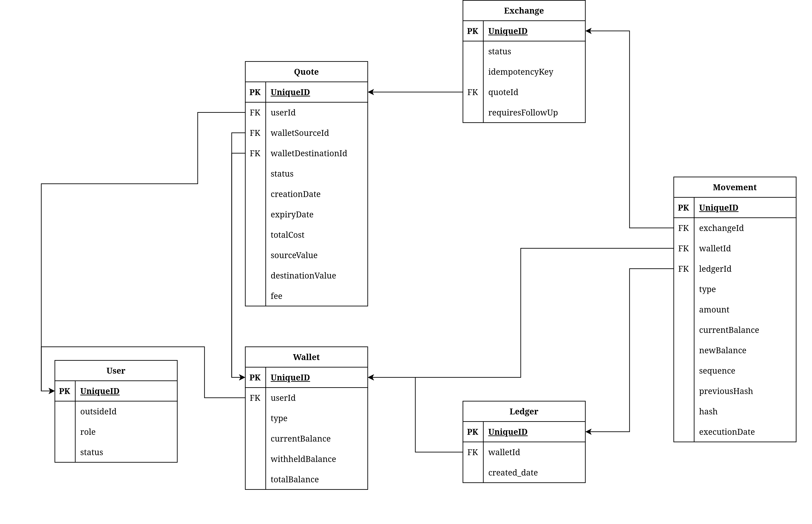
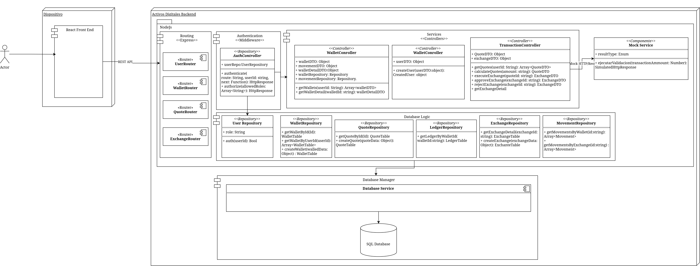

# Plataforma de activos digitales

A continuación se muesra toda la información

## Cómo ejecutar el proyecto

Primero instala las dependencias:

```bash
npm install
```

Luego inicia el proyecto en modo desarrollo:

```bash
npm run dev
```

## Documentación de la API

La documentación Swagger está disponible en:

```text
/docs
```

## Base de datos

El proyecto utiliza PostgreSQL.

Para facilitar la ejecución del ejemplo, la base de datos ya está conectada automáticamente a una instancia de prueba en Supabase, por lo que no es necesario instalar ni configurar PostgreSQL localmente.

Por otro lado, dentro del proceso de ejecución del código al ejecutar el comando de NPM se ejecuta un script de inicialización que restablece los datos cargados en la base de datos para poder realizar las pruebas en limpio.

## Requisitos

- Node.js
- npm

# Arquitectura

## Diagrama de entidades

Para empezar con el proceso de diseño de la solución, se mapearon los elementos claves en materia de datos.



Aquí se puede visualizar la aproximación de cuales deberían ser los datos clave para el desarrollo de la solución.

Por un lado nos encontramos con el manejo de las billeteras asociadas a un usuario, esto es importante porque es con lo que más va a interactuar el usuario. Esta sección define como se pueden obtener las billeteras y que información es necesaria.

En el otro extremo nos encontramos con el Ledger, esta es la representación de la base que tiene asociado todos los movimientos realizados por el usuario, por lo que está conectado directamente a cada billetera digital y es parte clave del funcionamiento para mantener consistencia y trazabilidad de la información.

Finalmente, se puede ver la relación que se tiene entre un intercambio y la cotización, en principio la cotización genera los datos necesarios para poder hacer un intercambio, este almacena información que se obtiene de las reglas de negocio y de las billeteras del usuario para generar validaciones que luego pueden ser utilizadas para el intercambio.

## Diagrama de componentes simplificado

Debido al alcance de esta prueba, y teniendo en cuenta las entidades que van a ser involucradas, es necesario establecer un diagrama de componentes.

El siguiente diagrama pretende mostrar el flujo de datos y los componentes de software, tanto internos como externos, que hacen parte de la ejecución de cada uno de los procesos necesarios para esta solución.



Para este diagrama es clave explicar las secciones que lo componente, por lo que a continuación se describen:

- ### Dispositivo de acceso a la plataforma

Antes de siquiera empezar a construir una solución, tenemos que tener en cuenta el propósito de la misma, en este caso y basado en el contexto presentado, este desarrollo hace parte de un producto completo, con un frontend que se conectaría al despliegue de lo que sería este backend, por eso se agrega en este diagrama, porque es importante entender que funciones y llamados API tenemos que exponer para que la experiencia para el usuario sea exitosa.

- ### Capa de rutas de endpoints

Debido a lo explicado anteriormente, tenemos que exponer las funcionalidades que se van a implementar, por lo que en la solución deben existir los componentes que nos permitan ingresar, a través de REST y con los endpoints respectivos, a las funcionalidades. En el desarrollo esto se visualiza como el componente de enrutadores que permite acceder a cada uno de los endpoints solicitados como necesarios en este proyecto.

- ### Capa de autenticación

Ya que el alcance de esta prueba no solicita un proceso de autenticación completo, se crea un componente que simula esta autenticación a través del uso de Headers en la plataforma para autenticar y validar el acceso de cada tipo de usuario a cada uno de las funcionalidades expuestas a través de los endpoints, estos se encargan de validar que rol tiene acceso a cada endpoint con respecto al usuario en la base de datos. En el desarrollo esto se ejecuta como un middleware, que es una pieza de software que permite validar los requests de un llamado API y hacer validaciones antes de realizar cualquier tipo de ejecución de lógica, permitiendo bloquear y discriminar el acceso a cada una de las funcionalidades que están expuestas en el servicio.

- ### Capa de manejo de información (Base de datos)

Esta capa tiene la labor de hacer concreto las entidades que nos encontramos en el diagrama anterior, por lo que tiene funciones especificas tipo CRUD sin logica de negocio, para poder hacer uso de los datos y el manejador de base de datos que soporta el acceso al mismo. En el desarrollo este se manifiesta en forma de Schemas y Repositorios, que representan los datos y la validación de los mismos, además de contener las funciones que permiten acceder, a través de una librería, a la información que se almacena en base de datos.

- ### Capa de lógica

Este es el nucleo de la solución, es el que se encarga de ejecutar las reglas de negocio, este se divide en controladores que separan las funciones de manera relacionadas, de forma que elementos que están relacionados como los movimientos, cotizaciones e intercambios que se deben realizar, como están tan integramente relacionados, hacen parte del mismo controlador.

- ### Simulador Software Externo

Este componente se plantea especificamente para este proyecto, esto debido a que una de las condiciones es la simulación de un sistema externo el cual actúa como un servicio al que el sistema se integra.
Este se desarrolla de forma que tenga todos los posibles casos que pueda tener un servicio online, como caida del servicio, problema de demoras, etc.
De manera que se puede probar fielmente un caso en el que el sistema tiene problemas con la conexión.

# Tecnologías seleccionadas

Para llevar a cabo este proyecto se utilizaron las siguientes herramientas:

## Desarrollo

### Framework

- NodeJs con TypeScript, con el propósito de tener el tipado que permite manejar estructuras bien definidas y validarlas
- Express: para el manejo básico de las entradas de API.

### Bases de datos

- PostgreSQL
- Supabase

### Librerias

- Decimal.js: Para el manejo de los números con precisión.
- dotenv: Para el uso de variables de ambiente.
- kysely: Para una absracción de las funcionalidades asociadas a Postgres pero utilizando herramientas más nativas para NodeJS con TypeScript.
- swagger-ui: Para la generación de las visuales de la documentación API.
- vitest: Para las pruebas automáticas.
- zod: Para el manejo de mejor tipado, extendiendo las capacidades de TypeScript para crear programas con menos errores y más seguros.

### Repositorio

- Github

### Diseño y arquitectura

- Draw.io
- Excalidraw

### Pruebas

- Postman

### Herramientas IA

# Ejemplos API

Con el proposito de facilitar el uso de la plataforma, se generó una colección de postman que puede ser cargada al programa para poder ver llamados reales y como se pueden consultar, estos ya tienen información como los Headers y otros elementos relacionados. **Es importante aclarara que los ids van a cambiar según la transacción que se vaya a hacer en ese momento.**

[Descargar archivo Postman Json](PlataformaActivos.postman_collection.json)

# Mockup FrontEnd

En el siguiente enlace se encuentra la propuesta de las pantallas de visualización de una app que podría consumir los servicios expuestos por esta plataforma;

## [Visualizar maqueta](https://excalidraw.com/#json=-jrkmqXOxD-Wip9ANFc0S,orzqEwjMJEsoQG21ybmOyQ)
